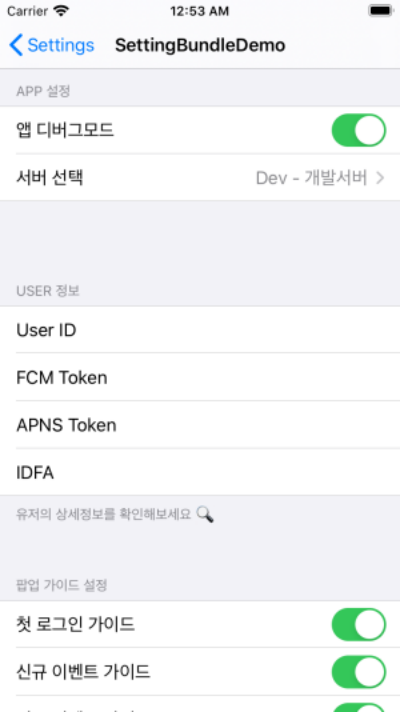

# SettingBundleDemo 

앱 테스트를 위해서는 설정페이지를 만들어야 하는 경우가 있습니다. 이러한 경우 앱 내에 설정 페이지를 넣어도 되지만 iOS에서 기본으로 지원해주는 `Setting Bundle` 기능을 이용하여 손쉽게 구현 할 수도 있습니다. 




다음의 경우는 `Setting Bundle` 을 이용하기에 충분한 조건들 입니다.  

```sh
1. 디버그 버전에서 앱 테스트를 위하여 값들을 변경해보고 싶은 경우 
2. `UserDefaults` 에 저장된 값을 가지고 테스트를 해야하는 경우 
```

# Reference 🔗
-  [iOS Setting Bundle을 이용한 앱 테스트 환경 구성하기](https://fernando.kr/ios/2020-07-29-ios-setting-bundle/) 해당 블로그 내용을 참조하시면 도움이 되실거에요 